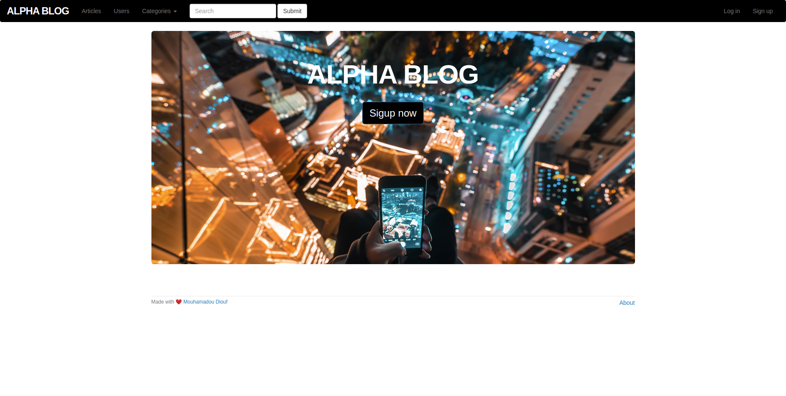

# Alpha Blog

> A simple blog where users can manage their articles and check other peoples articles



Additional description about the project and its features.

## Built With

- HTML, CSS, Javascript, Ruby
- Ruby on Rails,

## Live Demo

[Live Demo Link](https://myalphamo.herokuapp.com/)


## Author

👤 **Mouhamadou Diouf**

- Github: [@MouhaDiouf](https://github.com/MouhaDiouf)
- Twitter: [@mouhamadiouf](https://twitter.com/mouhamadiouf)
- Linkedin: [Mouhadiouf](https://linkedin.com/mouhadiouf)

## Prerequisites

The setups steps expect following tools installed on the system.

- Github
- Ruby [2.4.0](https://github.com/organization/project-name/blob/master/.ruby-version#L1)
- Rails [5.0.2](https://github.com/organization/project-name/blob/master/Gemfile#L12)

##### 1. Check out the repository

```bash
git clone git@github.com:MouhaDiouf/alpha-blog.git
```

##### 2. Install gems 

Run the following commands to install the required gems.

```ruby
bundle install
```

##### 3. Start the Rails server

You can start the rails server using the command given below.

```ruby
bundle exec rails s
```

And now you can visit the site with the URL http://localhost:3000

## 🤝 Contributing

Contributions, issues and feature requests are welcome!

1. Fork it (https://github.com/MouhaDiouf/alpha-blog)
2. Create your feature branch (git checkout -b feature/[choose-a-name])
3. Commit your changes (git commit -am 'What this commit will fix/add')
4. Push to the branch (git push origin feature/[chosen name])
5. Create a new Pull Request


## Show your support

Give a ⭐️ if you like this project!
